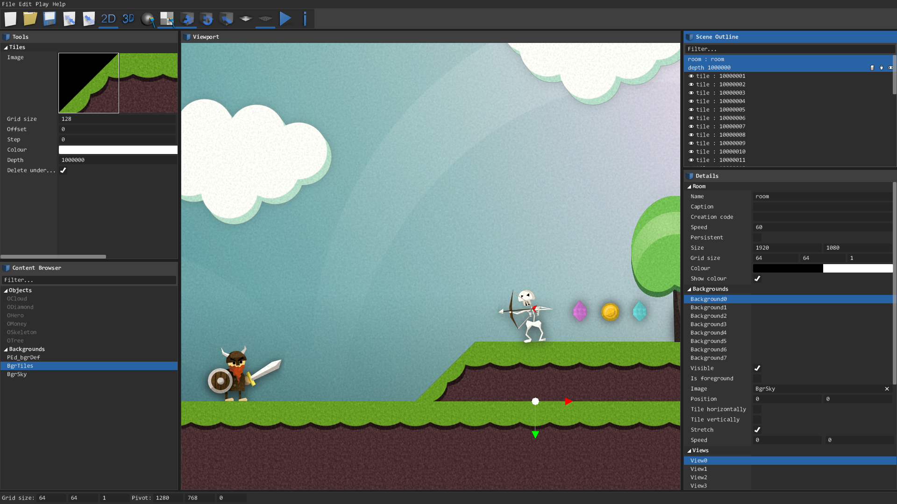
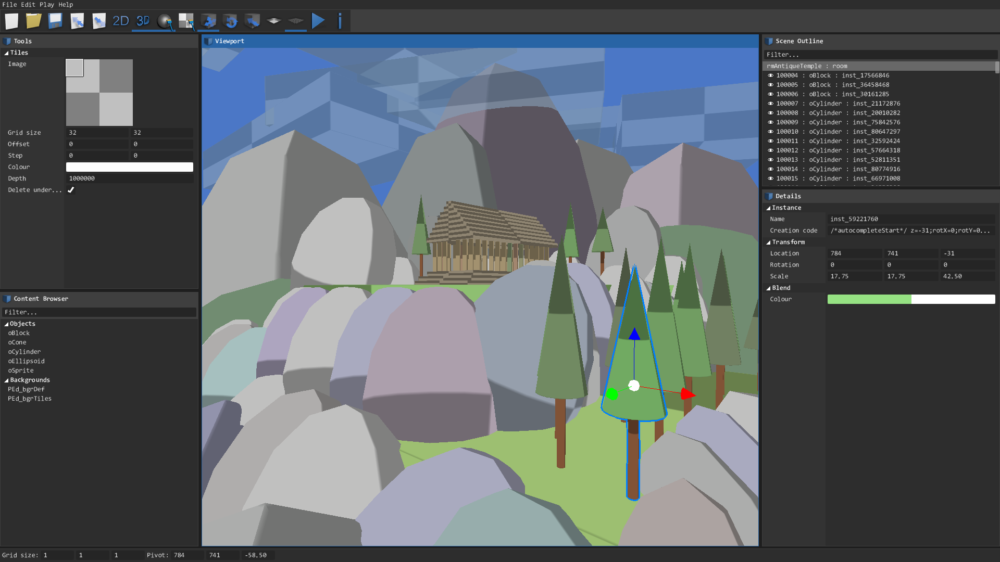

# PushEd
Or shortly just PEd, is a 2D/3D level editor for GameMaker: Studio 1.4, originally developed by our team [BlueBurn](blueburn.bluefile.cz/) as a paid extension, now available for free, for everyone, forever!

Maintained by: [kraifpatrik](https://github.com/kraifpatrik)

# Table of Contents
 * [Features](#features)
 * [Setup](#setup)
 * [Controls](#controls)

# Features
 * Intuitive controlls
 * Change all room and views settings
 * Drag&drop objects into the level
 * Grid alignment
 * Set instance creation code
 * Move, rotate and scale instances
 * Set instance colour and alpha
 * Multiple selection
 * Copy selected instances
 * Tile editing
 * Resizable window and panels
 * Save and load rooms (*.room.gmx)
 * Level export and import (external file loadable on runtime, suitable for modding)

# Setup
It can happen that PEd uses different variables for object transformations than you have in you project. So before starting to use PEd, we recommend you to check if the variables are matching, otherwise you would not be able to use the editor. To do so, go to Macros > Default and you should see a short list of constants. Each constants represents a variable.

Macro              | Description
------------------ | -----------
`PEd_VAR_POS_X`    | Instance position on X axis
`PEd_VAR_POS_Y`    | Instance position on Y axis
`PEd_VAR_POS_Z*`   | Instance position on Z axis
`PEd_VAR_ROT_X*`   | Instance rotation around X axis
`PEd_VAR_ROT_Y*`   | Instance rotation around Y axis
`PEd_VAR_ROT_Z`    | Instance rotation around Z axis
`PEd_VAR_SCALE_X`  | Instance scale on X axis
`PEd_VAR_SCALE_Y`  | Instance scale on Y axis
`PEd_VAR_SCALE_Z*` | Instance scale on Z axis
`PEd_VAR_COLOUR`   | Instance colour
`PEd_VAR_ALPHA`    | Instance alpha

**List of automatically saved variables:**

 `x`, `y`, `image_angle`, `image_xscale`, `image_yscale`, `image_blend`, `image_alpha`

These variables are ALWAYS saved into the room file (both GM's native and external). Any other additional variable has to be written into instance's creation code. Writing variables into the creation code is done by `PEd_instanceAutocompleteCode`. Loading variables from creation code, which is necessary only for external "*.bbmap" room files (in GM's native rooms this is done automatically), is done in `PEd_assignVariable`. So if you make any changes to the constants, make sure that you have also rewritten variable names in those two scripts.

> \* - Additional variables, necessary only for 3D transformations. If you are using PEd for creating 2D levels, you can leave these constants as they are.

# Controls
## Global
Controls     | Action
------------ | ------
Alt          | Hold down to temporarily disable snapping to grid.
Ctrl+A       | Clear selection.
Ctrl+C       | Copy selected instanes/tiles.
Ctrl+E       | Export room.
Ctrl+F       | Switch drawing of the floor.
Ctrl+G       | Switch snapping to grid.
Ctrl+I       | Import room.
Ctrl+N       | Create new room.
Ctrl+O       | Open room.
Ctrl+S       | Save room.
Ctrl+Shift+S | Save room as...
Del          | Destroy selected instances/tiles.
F10          | Switch between Play and Editor.
F1           | Show/hide debug.
F2           | Switch between 2D/3D mode.
F3           | Cycle between editing modes.
LMB          | Move pivot.
Num0..9      | Set camera speed. The higher the number the faster will camera move.
Tab          | Cycle between tools.

## 3D mode
Controls         | Action
---------------- | ------
Arrow keys       | Look around.
MW               | Move camera.
RMB              | Look around.
W, S, A, D, Q, E | Move camera.
Shift            | Hold down to move faster.

## 2D mode
Controls          | Action
----------------- | ------
Arrow keys        | Move camera.
MW                | Zoom camera.
Page Up/Page Down | Zoom camera.
RMB               | Move camera.
Shift             | Hold down to move faster.

## Object edit mode
Controls | Action
-------- | ------
Ctrl+LMB | Add/remove instance to/from multiple selection.
LMB      | Select instance.

## Tile edit mode
Controls       | Action
-------------- | ------
Ctr+LMB        | Create tile.
Ctr+RMB        | Delete tile on the mouse position.
LMB            | Select tile.
Shift+Ctrl+LMB | Spawn tiles.
Shift+LMB      | Add/remove tile to/from multiple selection.

> LMB - left mouse button
> MMB - middle mouse button
> MW - mouse wheel
> RMB - right mouse button
